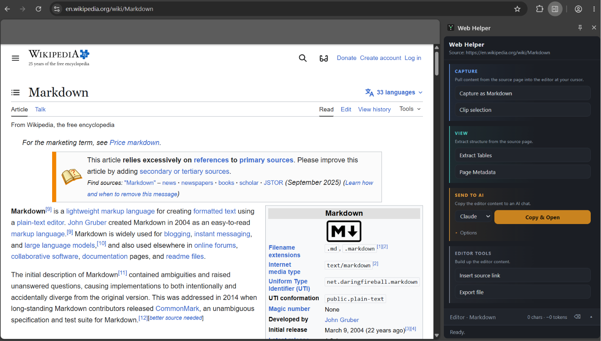
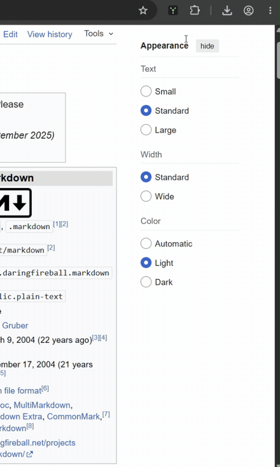

# Web Helper

A side-panel workbench for capturing web pages and selections as clean markdown —
edit it locally, then copy or export it to the AI assistant of your choice.

## Why this exists

- **Capturing web content for an AI is fiddly.** Copy-paste drags in navigation,
  ads, and hidden junk; Web Helper gives you clean markdown of the page or just
  your selection, dropped where your cursor is.
- **No accounts, no API keys, nothing leaves your machine.** Everything is
  assembled locally and stored on your computer. Sending to an AI is always a
  manual paste — never auto-submitted.
- **Built for research and personal use** — direct, honest about its tradeoffs,
  and small enough to read end to end.

## Install

> **Chrome Web Store:** listing is under review — coming soon. Until then, install
> unpacked in three steps below (30 seconds, no build step).

### 1. Get the extension

Download the latest release ZIP and unzip it:

**→ [web-helper-v0.5.0.zip](https://github.com/saarsg/web-helper/releases/latest/download/web-helper-v0.5.0.zip)**

It unzips to a folder containing `manifest.json` and the extension files directly
— that folder is exactly what you load, nothing to dig into.

> Prefer the source? `git clone https://github.com/saarsg/web-helper.git` — then
> load the **`extension/`** subfolder instead (Chrome ignores the repo's other files).

### 2. Load it in your browser

1. Open `chrome://extensions` (or `edge://extensions` / `brave://extensions`).
2. Toggle **Developer mode** (top-right).
3. Click **Load unpacked** → select the unzipped folder (the one with `manifest.json`).
4. Pin it from the puzzle-piece menu.

### 3. First run

Click the icon — the side panel opens. Chrome warns the extension can **read your
data on all websites**: that is the `host_permissions` it uses to auto-follow your
active tab — see [Permissions and security](#permissions-and-security) for what
that does and does not mean.

**Updating:** `git pull` (or re-download the ZIP), then click the circular-arrow
**reload** icon on the extension's card in `chrome://extensions`.

## Usage

1. Click the toolbar icon → the **side panel** opens beside the page.
2. The capture **source auto-follows your active tab** — the panel header always
   shows the current source URL, so you can see what *will* be captured.
3. **Capture as Markdown** grabs the page (or your selection) as fenced markdown,
   inserted at your cursor in the editor.
4. Other captures: **Clip selection** (attributed blockquote), **Extract Tables**,
   **Page Metadata**.
5. Edit freely. The editor content persists across restarts.
6. **Send to AI** → pick a provider and **Copy & Open**: the text is copied to
   your clipboard and the AI chat opens in a new tab. You paste it — nothing is
   auto-submitted.
7. **Options ▸** reveals extras: output format (markdown / HTML / plain / JSON),
   **Isolate page from prompt** (fences the content in a `<document>` block so the AI
   reads it as data, not instructions — the guard against injected prompts), and a
   prompt **Instruction** (built-in or your own saved presets).
   **Insert source link** and **Export file** live under Editor tools.

Browser/internal pages (`chrome://`, the web store, `view-source:`) can't be
scripted by any extension — capturing one shows a clear message, not an error.

## Permissions and security

Web Helper's permissions are **deliberately not minimal**, and the reasoning is
worth stating plainly.

### Why `<all_urls>`

The capture source auto-follows your active tab: switch tabs and the next capture
hits the page now in front of you, with no per-page click to grant access. To
inject the capture script into *whatever* tab you switch to, the extension needs
host access to all sites. An earlier version used `activeTab` (access only to the
tab you clicked from); that broke capture the moment you switched tabs, which is
the friction this design fixes.

**Reading is not sending.** Chrome's warning reflects that the extension *can*
read every page you visit. It does not transmit them. Captured content is
assembled locally and stored only in `storage.local`; nothing leaves your machine
unless you explicitly copy or export it. The extension makes no network requests
of its own.

### Page content is treated as untrusted

A captured page can carry prompt-injection payloads aimed at an AI you later paste
into — including ones invisible to you on screen. The guiding rule is **what you
paste is what you could have seen**: every markdown capture closes the invisible
traps and frames the rest as data.

- **Captures only what's actually visible.** Hidden elements are detected on the
  live, rendered page (computed style + geometry) and dropped before conversion —
  `display:none`, `visibility:hidden`, `opacity:0` (incl. near-zero), off-screen
  positioning, zero-size, `clip` / `clip-path`, the `.sr-only` pattern,
  `aria-hidden`, plus structural noise (`script`/`iframe`/`nav`/…). This also
  catches **class- and stylesheet-based hiding**, not just inline styles.
- **Neutralizes invisible Unicode** used to smuggle instructions — the Unicode
  Tags block ("ASCII smuggling"), zero-width and bidi-override characters — each
  replaced with a visible `␟` marker, with a count noted in the capture so you can
  see the page tried to hide something.
- **Strips exfiltration and active-content vectors** in the markdown: external and
  `data:` image URLs (auto-fetch exfil) → text placeholders, HTML comments,
  `on*` event handlers, and unsafe link schemes (`javascript:` / `data:` / …).
- **Wraps output in an UNTRUSTED-CONTENT fence** so a downstream AI or human sees
  it is data, not instructions — and **never auto-submits**: Copy & Open only puts
  text on your clipboard; you paste.

**Full threat model — what's defended, and the honest limits — is in
[`docs/security.md`](docs/security.md).** Per-permission justifications (as submitted
to the Chrome Web Store) are in
[`docs/permission-justifications.md`](docs/permission-justifications.md).

The one limit worth stating up front: these defenses stop *invisible* traps, not
**visible** adversarial prose written in plain sight. That is real content; the
UNTRUSTED-CONTENT fence plus the receiving AI are its only guard.

An API-key "summarize on device" path is **deliberately not built** — it would
send page content off-machine, breaking the never-auto-submit invariant. It's held
for an explicit opt-in.

## How it works

Built on Chrome's side panel + `scripting` APIs; the capture source auto-follows
your active tab. For the full technical reference — architecture, the feature
table, how to add a feature, and browser support — see
[`extension/README.md`](extension/README.md).

## License

Open source. See [LICENSE](LICENSE).
